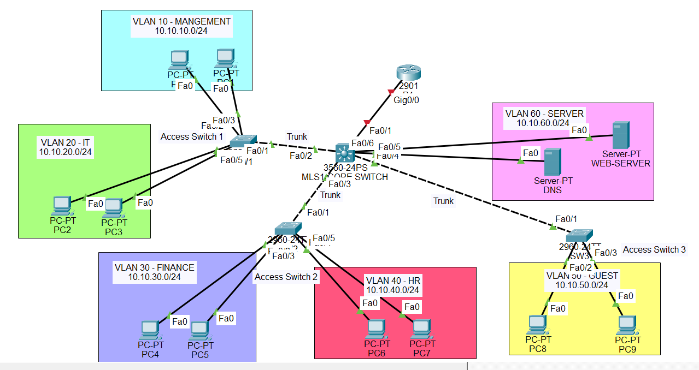

# Enterprise Network Lab

Enterprise network infrastructure project built using Cisco Packet Tracer.

## Current Progress

- [x] Network topology design
- [ ] VLAN configuration
- [ ] IP addressing
- [ ] Inter-VLAN routing
- [ ] DHCP
- [ ] DNS
- [ ] NAT
- [ ] ACL
- [ ] Network testing

## Topology

## Technologies

- Cisco Packet Tracer
- Cisco IOS
- VLAN
- Inter-VLAN Routing
- DHCP
- DNS
- NAT
- ACL
bl